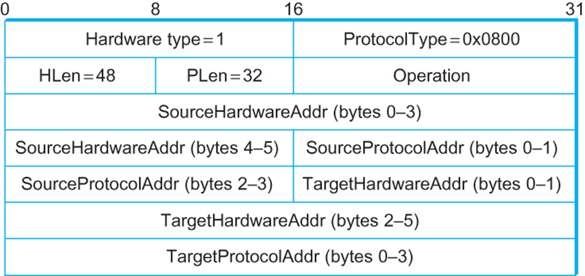

---
aliases:
  - Address Resolution Protocol
tags:
  - protocol
---
Address Resolution Protocol (ARP)

ARP table:
- Used to determine the interface's MAC address given its IP address
- Entries are `<IP address; MAC address; TTL>`
- TTL - Time after which address mapping will be forgotten (typically 20 minutes)
	- Because devices can die without telling server

## Steps

1. A wants to send datagram to B
	- B's MAC address not in A's ARP table
2. A broadcasts ARP query packet, containing B's IP address
	- Destination MAC address = `FF-FF-FF-FF-FF-FF`
	- All nodes on LAN receive ARP query
	- Query includes A's MAC address so B can respond
3. B receives ARP packet, replies to A with B's MAC address
	- Frame sent to A's MAC address (unicast)
4. A caches (saves) IP-to-MAC address pair in its ARP table until TTL
	- Soft state: Information that times out unless refreshed
5. ARP is "plug-and-play":
	- Nodes create their own ARP tables without intervention from net administrator

## ARP Packet Format

- HardwareType: type of physical network (e.g. Ethernet)
- HLen: length of physical address
- PLen: length of protocol address
- Operation: Request or Response
