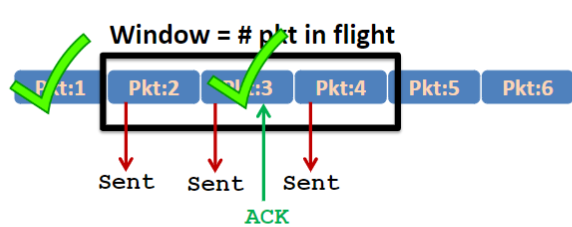
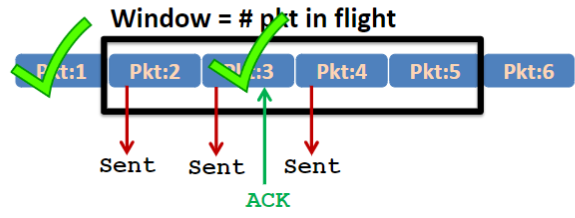

- Sender sends a bunch of packets at once without waiting for ACKs right then
- Receiver sends an ACK for each packet it receives
- When the sender receives an ACK, it knows the packet was delivered, so it slides the window forward
## Pipelining

Pipelining: sender allows multiple, "in-flight," yet-to-be-acknowledged packets
- Range of sequence numbers must be increased
- Buffering at sender and/or receiver
- Goal: Increased utilization

## Dealing with packet loss

1. Go-Back-N: Retransmit all un-ACK-ed packets
	- Send N packets at once
	- If the kth packet (where 1 <= k <= N) doesn't make it to receiver, packets k..N must be resent (**wasteful**)
2. Selective Repeat/Selective Retransmit: Retransmit only lost packets
	- Unlike Go-Back-N, receiver may selectively reject a single packet, rather than all the packets following a packet in a particular window

## How to Slide Window Forward

If a packet in the middle of the window is ACKed but not the ones before it, the end of the window moves forward but not the start
- Window size doesn't actually grow
- I think this is actually only applicable to Selective Repeat. With Go-Back-N, you'd resend everything after the first lost/rejected packet

## Throughput

Utilization with a window size of 3 (fraction of time sender busy sending):
$$U_{\text{sender}} = \frac{3 \cdot L/R}{RTT+L/R}$$

With a window size of 3, utilization is 3 times that of [Stop and Wait](Stop%20and%20Wait.md)
