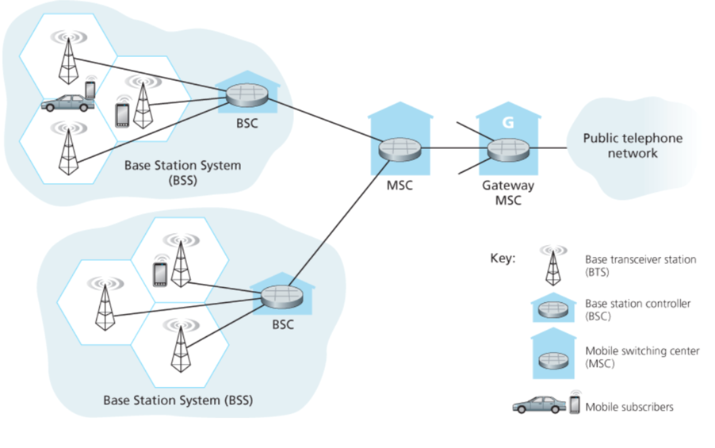
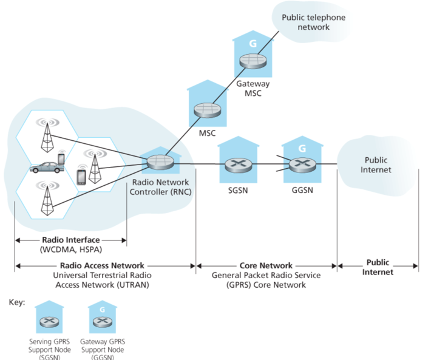
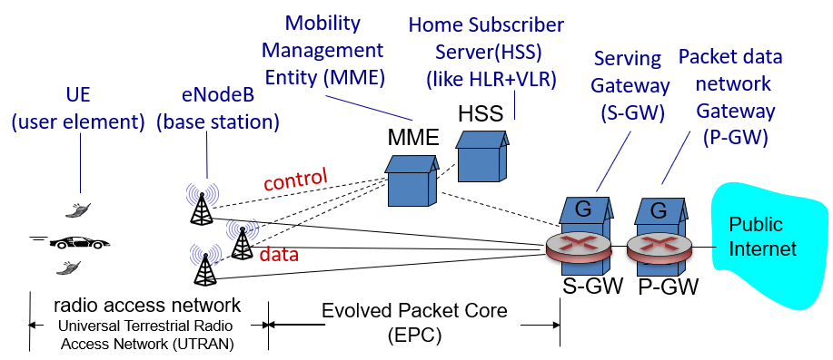
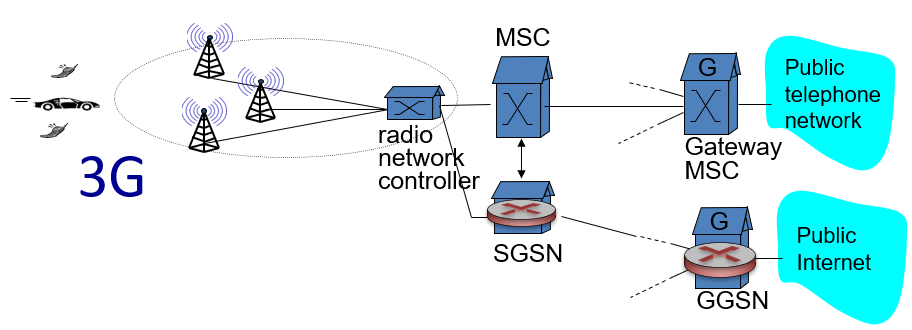
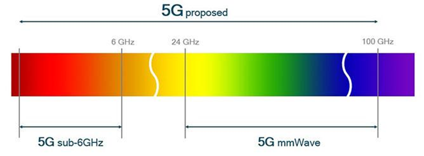
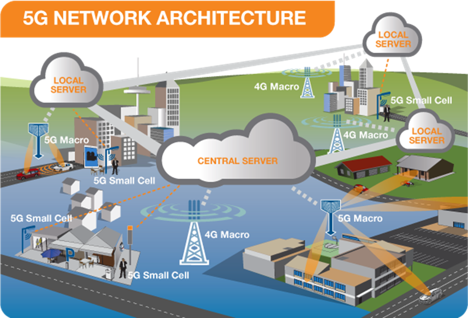

The different generations of [Cellular Networks](Cellular%20Networks.md)

## 2G

## 3G

Voice + Data

Key insight: new cellular data network operates in *parallel* except at edge with existing cellular voice network
- Voice network unchanged in core
- Data network operates in parallel

## 4G

### Differences from 3G

- All IP core: IP packets tunneled (through core IP network) from BS to gateway
- No separation between voice and data - all traffic carried over IP core to gateway

This is how 3G works:

## 5G

