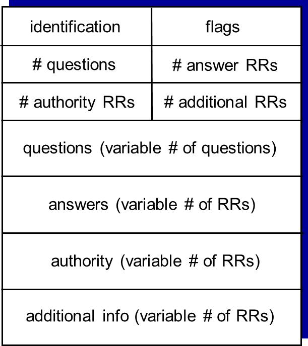

---
aliases:
  - Domain Name System
---
Domain Name System (DNS)
- A distributed, hierarchical database
- Works at the [Application Layer](OSI%20layers/Application%20Layer.md)
- Maps URLs and email address entered by humans to the IP addresses that are used at lower [OSI layers](OSI%20layers/OSI%20Architecture.md)

Not centralized because it wouldn't scale:
- Single point of failure
- Traffic volume
- Distant centralized database
- Maintenance

## Kinds of Servers

### Root DNS Servers

- Contacted by local name servers that cannot resolve a name
- If name mapping not known, gets mapping from authoritative name server
- Returns mapping to local name server

There are only 13 logical root name servers, but each "server" is replicated many times over the globe

### Top-Level Domain (TLD) DNS Servers

- Responsible for com, org, etc. and all top-level country domains (uk, fr, ca, etc.)
- For example, Network Solutions maintains servers for the `.com` TLD

### Authoritative DNS Servers

- Organization's own DNS server(s)
- Provide authoritative hostname to IP mappings for organization's named hosts
- Can be maintained by organization or service provider

## Name Resolution

Recursive query:
- Puts burden of name resolution on contacted name server
	- Heavy load at upper levels of hierarchy?
	- Ameliorated by caching
- Example:
	- Host (cs.stanford.edu) requests IP for cs.umd.edu from local DNS server
	- Local DNS server (dns.cs.stanford.edu) sends request to root DNS server
	- Root DNS server sends request to TLD DNS server
	- TLD DNS server sends request to authoritative DNS server
	- Authoritative DNS server (dns.cs.umd.edu) responds back to TLD DNS server
	- TLD DNS server responds back to root DNS server
	- Root DNS server responds back to local DNS server
	- Local DNS server responds back to original host

- Information is stored at the [network edge](Network%20edge.md) (e.g. clients) rather than core routers

## Caching, Updating Records

- Once any name server learns a mapping, it caches the mapping
	- Cache entries time out after some time (TTL)
	- TLD servers typically cached in local name servers
		- So, root name servers not often visited
- Cached entries may be out-of-date (best effort name-to-address translation)
	- If name host changes IP address, may not be known Internet-wide until all TTLs expire

## Services

DNS services:
- Host name to IP address translation
- Host aliasing
	- Canonical, alias names
- Mail server aliasing
- Load distribution
	- Replicated Web servers: many IP addresses correspond to one name

## DNS Records

Resource record (RR) format: `(name, value, type, TTL)`

Types:
- A
	- `name` is hostname
	- `value` is IP address
- NS
	- `name` is domain (e.g. foo.com)
	- `value` is hostname of authoritative name server for this domain
- CNAME
	- `name` is alias for some canonical name (e.g. ibm.com is really servereast.backup2.ibm.com)
	- `value` is canonical name
- MX
	- `value` is name of mail server associated with `name`

### Inserting records into DNS

Example:
- You have a startup "Network Utopia"
- Register name `networkutopia.com` at DNS registrar
	- Provide names, IP addresses of authoritative name server (primary and secondary)
	- Registrar inserts two RRs into .com TLD server:
		1. `(networkutopia.com, dns1.networkutopia.com, NS)`
		2. `(dns1.networkutopia.com, 123.4.5.1, A)` (authoritative server)

## DNS Protocol

Query and reply messages both use the same format

Message header:
- Identification: 16-bit number for query
	- Response uses same number
- Flags:
	- Query or reply
	- Recursion desired
	- Recursion available
	- Reply is authoritative

Body:
- Questions section has `(name, type)` fields for a query
- Answers section has RRs in response to query
- Authority section has RRs for authoritative servers
- Additional helpful info at end

