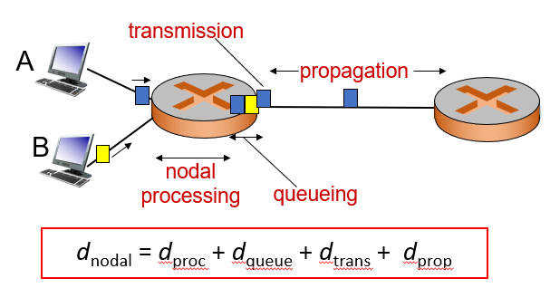

Four sources of delay if you use [packet switching](Packet%20switching.md):
- **Transmission delay**: How fast the router can send data to the network
	- Transmission delay = L/R, where L is packet length (bits) and R is bandwidth (bits per second)
	- Limited [bandwidth](Bandwidth.md) is biggest cause of transmission delay
- **Nodal processing delay**: Time taken to process the packet
	- Check bit errors
	- Determine output link
	- Typically less than a millisecond
- **Queueing delay**: Time waiting at output link for transmission
	- Depends on congestion level of router
- **Propagation delay**: How long it takes to travel from the router to the next point
	- Propagation delay = d/v
	- d = length of physical link
	- v = propagation speed

> [!warn]
> Transmission delay and propagation delay are *very* different, don't confuse the two.

