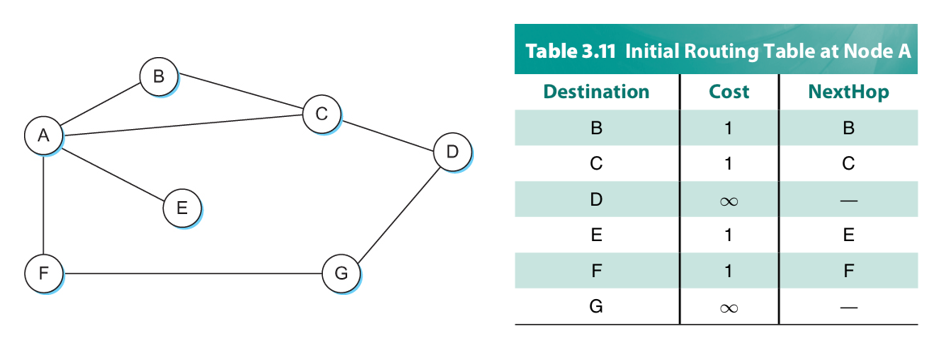
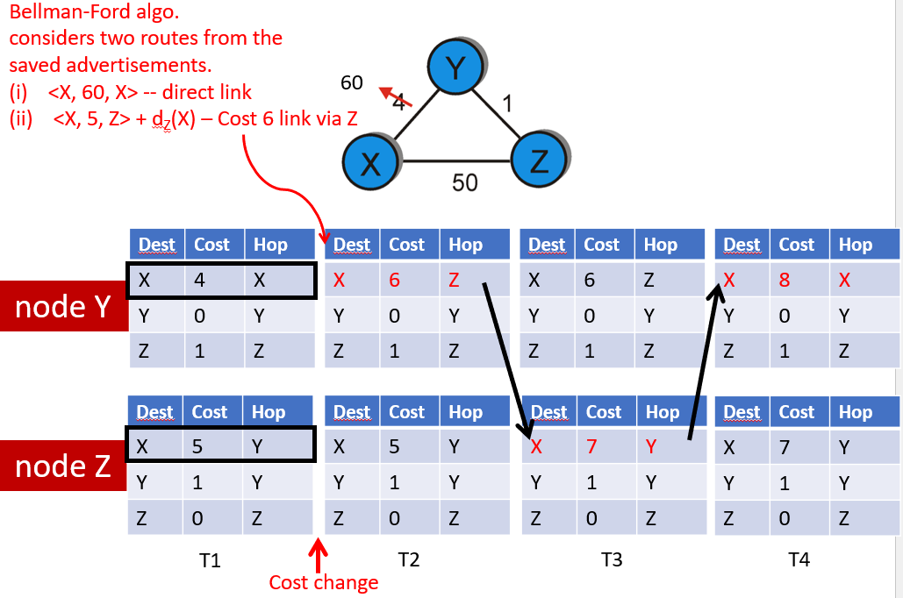

- Each node constructs a vector containing the distances to all other nodes and distributes that vector to its immediate neighbors
- Starting assumption is that each node knows the cost of the link to each of its directly connected neighbors
- The NextHop column in the table below tells it which node to send packets to to get to the desired destination



## Protocol

1. Advertise: A router transmits its distance vector to each of its neighbors in a routing packet
	- Two circumstances when a node sends out routing circumstances:
		1. Periodic: Automatically after some time
		2. Triggered: When an event makes a change to its routing table (e.g. link fail or new message from neighbor)
2. Each router receives and saves the most recently received distance vector from each of its neighbors
3. Update: A router recalculates its distance vector when:
	- It receives a distance vector from a neighbor containing different information than before, OR
	- It discovers that a link to a neighbor has gone down or the cost has changed

For a worked out example, see [the PowerPoint for lecture 3](https://www.cs.umd.edu/class/spring2024/cmsc417/course_materials/slides/3_internetworking_DV_routing.pptx) (specifically, slides 36 onwards)

## Algorithm

Uses [Bellman-Ford algorithm](https://en.wikipedia.org/wiki/Bellman%E2%80%93Ford_algorithm) (dynamic programming)

```python
def distance(x, y):
    min(distance(x, v) + distance(v, y) for v in neighbors(y))
```

Key ideas:
- From time to time, each node sends its own distance vector estimate to its neighbors
- The neighbors then update their distance vectors using Bellman-Ford
- Under minor, natural conditions, the distance estimates converge to the actual least costs

Each node `x` does the following:

1. Initialize `x`
2. For every neighbor `y`:
	- `D[x][y] = cost(x, y)`
	- We don't know about nodes that aren't neighbors, so the cost to them is basically infinity at this point
3. Send distance vector `D[x]` to all neighbors
4. Loop forever:
	1. Wait until you receive a distance vector from some neighbor `w`
	2. For each node `y`, update distance to `y` using Bellman-Ford
	3. If the distance to any of the neighbors was updated, send the new distance vector to all neighbors

Algorithm characteristics:
- Iterative, asynchronous
	- Each local iteration caused by:
		- Local link cost change
		- Distance vector update message from neighbor
- Distributed
	- Each node notifies neighbors *only* when distance vector changes
		- Neighbors then notify their neighbors if necessary

## Link failure and cost updates

1. Node detects local link cost change
2. Updates routing info, recalculates distance vector
3. If distance vector changes, notify neighbors

If link fails:
- You can remove them from the routing table entirely
- Or you can keep them in the table but update cost to infinity

PowerPoint 3 (linked somewhere above) shows it step-by-step

### Count-to-infinity problem

If the link cost *increases*, that can be problematic:
- The distance between Y and X should actually be 51 now
- But Y will think it's 6
	- Because the distance between Z and X is stored as 5
	- And the distance between Y and Z is 1
- Then Z will update its distance to X to 7
- Then Y will update its distance to X to 8
- And so on, infinitely...



Some solutions to count-to-infinity problem:
1. Have a small number for infinity, so at least it stops at some point
	- In the [Routing Information Protocol](Routing%20Information%20Protocol), the max number of hops is typically 15 or 16
	- If a network is more than 15 hops away, it is considered unreachable
	- This may work for smaller networks, but not larger networks
2. Split horizon
	- Tries to avoid loops while advertising (but doesn't always work)
	- Improves time to stabilize routing
	- When a route sends a routing update to its neighbors, it does not send the routes it learned from each neighbor back to that neighbor
	- So in the example above, since Z has route (X, 5, Y) in its table, it won't send (X, 5) to Y because the distance 5 route to X passes through Y
3. Poison reverse - stronger version of split horizon
	- Advertise a bad route (set cost to infinity)

## Limitations

- Assumes small networks
- Possibility of routing loops
- Has static and pre-determined link costs
	- Link costs can actually change after the network starts up

