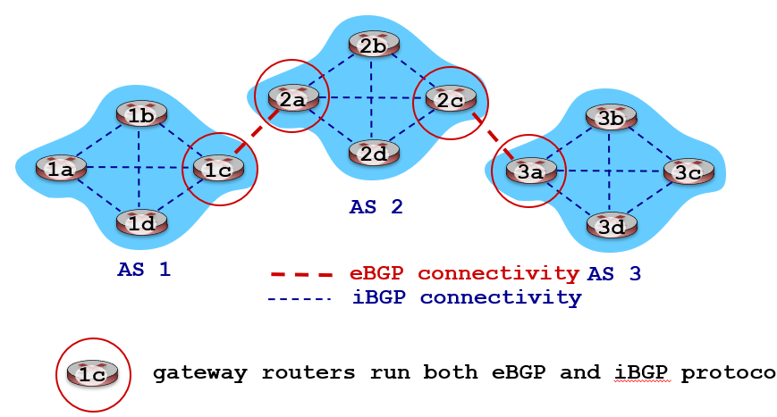

---
tags:
  - protocol
aliases:
  - Inter-AS Routing
  - Border Gateway Protocol
---
Border Gateway Protocol (BGP) is the de-facto [Inter-Domain Routing](Inter-Domain%20Routing.md) protocol

BGP provides each AS a means to:
- eBGP (exterior BGP): Obtain subnet reachability information from neighboring ASes
- iBGP (internal BGP): Propagate reachability information to all AS-internal routers
- Determine "good" routes to other networks based on reachability information and policy

Allows subnets to advertise their existence to rest of Internet

BGP session:
- Two BGP routers (peers) exchange BGP messages over semi-permanent TCP connection
	- Advertising paths to different destination network prefixes (BGP is a path vector protocol)
- When AS3 gateway router 3a advertises path `AS3,X` to AS2 gateway router 2c,
	- AS3 promises to AS2 that it will forward datagrams towards X

## Path attributes and BGP routes

- Advertised prefix includes BGP attributes
	- Prefix + attributes = route
- Two important attributes:
	1. `AS-PATH`: list of ASes through which prefix advertisement has passed
	2. `NEXT-HOP`: indicates specific internal-AS router to next-hop AS
- Policy-based routing:
	- Gateway receiving route advertisement uses import policy to accept/decline path (e.g. never route through AS Y)
	- AS policy also determines whether to advertise path to other neighboring ASes

## BGP path advertisement

- AS2 router 2c receives path advertisement `AS3,X` (via eBGP) from AS3 router 3a
- Based on AS2 policy, AS2 router 2c accepts path `AS3,X` and propagates (via iBGP) to all AS2 routers
- Based on AS2 policy, AS2 router 2a advertises (via eBGP) path `AS2,AS3,X` to AS1 router 1c

