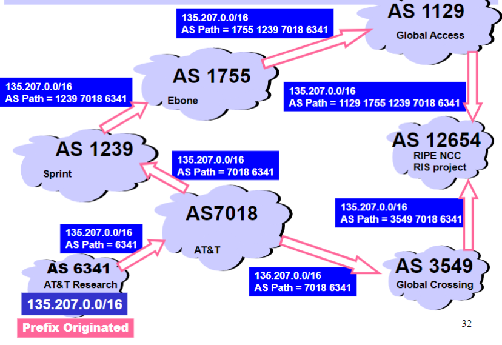

---
tags:
  - protocol
aliases:
  - Inter-AS Routing
  - Border Gateway Protocol
  - iBGP
  - eBGP
---
Border Gateway Protocol (BGP) is the de-facto [Inter-Domain Routing](Inter-Domain%20Routing.md)/EGP protocol

BGP provides each AS a means to:
- eBGP (exterior BGP): Obtain subnet reachability information from neighboring ASes
- iBGP (internal BGP): Propagate reachability information to all AS-internal routers
- Determine "good" routes to other networks based on reachability information and policy

Allows subnets to advertise their existence to rest of Internet

BGP session:
- Two BGP routers (peers) exchange BGP messages over semi-permanent TCP connection
	- Advertising paths to different destination network prefixes (BGP is a path vector protocol)
- When AS3 gateway router 3a advertises path `AS3,X` to AS2 gateway router 2c,
	- AS3 promises to AS2 that it will forward datagrams towards X

## Path attributes and BGP routes

- Advertised prefix includes BGP attributes
	- Prefix + attributes = route
- Two important attributes:
	1. `AS-PATH`: list of ASes through which prefix advertisement has passed
	2. `NEXT-HOP`: indicates specific internal-AS router to next-hop AS
- Policy-based routing:
	- Gateway receiving route advertisement uses import policy to accept/decline path (e.g. never route through AS Y)
	- AS policy also determines whether to advertise path to other neighboring ASes

## BGP path advertisement

- AS2 router 2c receives path advertisement `AS3,X` (via eBGP) from AS3 router 3a
- Based on AS2 policy, AS2 router 2c accepts path `AS3,X` and propagates (via iBGP) to all AS2 routers
- Based on AS2 policy, AS2 router 2a advertises (via eBGP) path `AS2,AS3,X` to AS1 router 1c

==TODO take notes on BGP path advertisement (see lecture 24)==

## BGP, OSPF, forwarding table entries

How does router set forwarding table entry to distant prefix?

==TODO take notes (see start of lecture 25)==

## BGP Route Selection

Router may learn about more than one route to destination AS, selects route based on:
1. Local preference value attribute: Policy decision
2. Shortest `AS_PATH`
3. Closest `NEXT_HOP` router: [Hot Potato Routing](Hot%20Potato%20Routing.md)
4. ...additional criteria

## Nontransit vs Transit ASes

- Internet service providers often have transit networks
- Nontransit AS might be a corporate or campus network
	- Could be a content provider

Traffic is **never** supposed to flow from an ISP (transit network) through a nontransit AS to another ISP (also a transit network)

### Selective Transit

Most transit networks transit in a selective manner

### Customers and Providers

Customer pays provider for access to the Internet

Customers don't always need BGP
- Static routing is the most common way of connecting an autonomous routing domain to the Internet

Customer-provider hierarchy:

### The Peering Relationship

- Peers provide transit between their respective customers
- But they don't provide transit between peers
- Often don't exchange money to help each other out
	- If they didn't provide transit between their customers, Internet would become disconnected
	- Hence, they do it for free

### Peering provides shortcuts

Peering also allows connectivity between the customers of Tier 1 providers

## BGP Operations Simplified

1. Establish BGP session on TCP port 179
2. Exchange all active routes
3. While connection is alive, exchange incremental route update messages

## Four Types of BGP Messages

1. Open: Establish a peering session
2. Keep alive: Handshake at regular intervals
3. Notification: Shuts down a peering session
4. Update: Announcing new routes or withdrawing previously announced routes
Announcement = Prefix + Attribute values

## BGP Attributes

Most important attributes:
- `AS_PATH`
- `NEXT_HOP`
- `MULTI_EXIT_DISC`
- `LOCAL_PREF`
- `COMMUNITY`
- `ORIGINATOR_ID`
- `CLUSTER_LIST`

Attributes are used to select best routes
- Given multiple routes to the same prefix, a BGP speaker must pick **at most one** best route
	- It could reject them all

Next Hop attribute: Every time a route announcement crosses an AS boundary, the Next Hop attribute is changed to the IP address of the border router that announced the route

## Join EGP with IGP for Connectivity

## Implementing customer/provider and peer/peer relationships

Two parts:
- Enforce transit relationships
	- Outbound route filtering
- Enhance order of route preference
	- Provider < peer < customer

## Import Routes

## Export Routes

## BGP Communities

BGP communities are how routes are colored
- A community value is 32 bits
	- By convention, first 16 bits are ASN indicating who is giving it an interpretation
	- Second 16 bits are community number
- Community values used for signaling within and between [AS](Autonomous%20System.md)s
- Very powerful because it has no predefined meaning

Community attribute: a list of community values
- So one route can belong to multiple communities

Two reserved communities:
- `no_export` = `0xFFFFFF01`: don't export out of AS
- `no_advertise` = `0xFFFFFF02`: don't pass to BGP neighbors

## Tweak Tweak Tweak

For inbound traffic:
- Filter **outbound** routes
- Tweak attributes on **outbound** routes in the hope of influencing your neighbor's best route selection

For outbound traffic:
- Filter **inbound** routes
- Tweak attributes on **inbound** routes to influence best route selection

> [!note]
> In general, an AS has more control over outbound traffic

## Route Selection Summary

## Local Preference Attribute

- Local preference attribute only used in iBGP
- Higher Local Preference values are preferred

## Implementing backup links with local preference (outbound traffic)

Forces **outbound** traffic to take primary link, unless link is down

Multihomed Backups (outbound traffic):

## `AS_PATH` Attribute

## Interdomain Loop Prevention

Border gateway will never accept a route with `ASPATH` containing itself
- e.g. gateway at AS 877 will never accept a route with `ASPATH = 1 333 877 7018`, because that would cause a cycle

## Traffic often follows AS_PATH, but not always

Traffic following AS Path:

Traffic **not** following AS Path:

## Shorter doesn't always mean shorter

Even if the AS Path from some AS `X` is shorter than the AS Path from another AS `Y`, within the AS `X`, a longer path might actually be taken
- So a shorter AS Path doesn't always mean a shorter path

## Shedding Inbound Traffic with `AS_PATH` Padding Hack

- Can repeat AS in `AS_PATH` in backup link
- Padding will usually force inbound traffic from AS 1 tot ake primary link

But padding may not shut off all traffic (as in the example below)
- AS 3 will send traffic on the backup link because it prefers customer routes, and local preference is prioritized over `AS_PATH` length
- Padding can still be used as a form of load balancing

The `COMMUNITY` attribute can help in that case:

## Hot Potato Routing

See [Hot Potato Routing](Hot%20Potato%20Routing.md)
