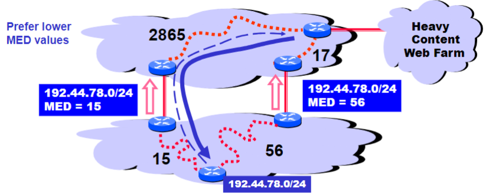

Cold potato routing with Multi-Exit Discriminator Attributes (MEDs):
- Used to handle problem with [Hot Potato Routing](Hot%20Potato%20Routing.md) (scroll to bottom of that page)

- MEDs must be considered before IGP distance
- Some providers will not listen to MEDs
- MEDs need not be tied to IGP distance
