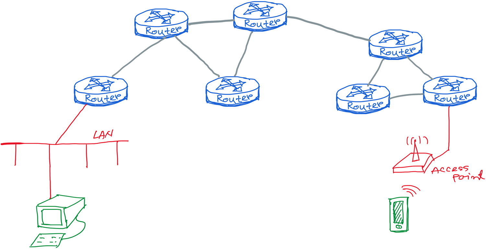
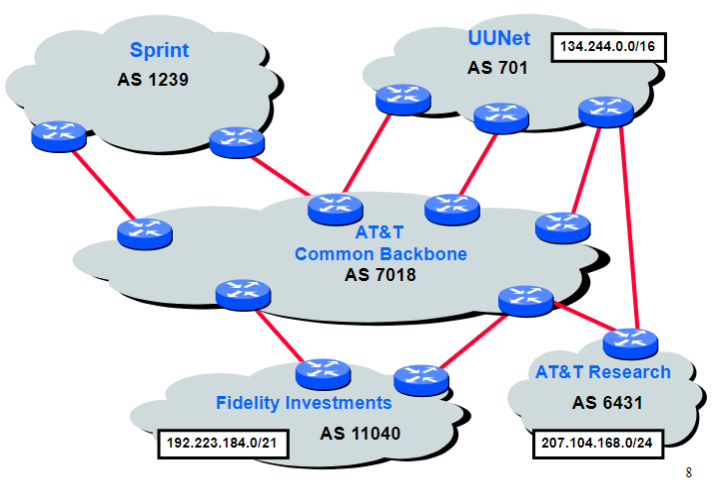
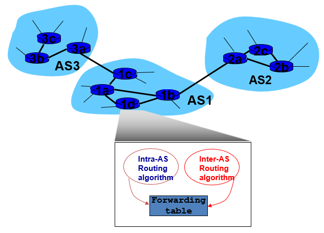
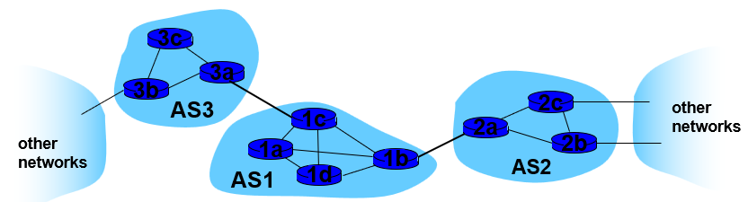

Our improved view of the internet:

## Making Routing Scalable

Our routing study so far has been idealized:
- All routers identical
- Network is "flat"

This is not true in practice:
- One network of routers cannot span the globe - not scalable
	- Can't store all destinations in routing tables
	- Routing table exchange would swamp links
- Administrative autonomy
	- Internet is network of networks
	- Each network admin may want to control routing in its own network

## Autonomous Routing Domains

A collection of physical networks glued together using IP that have a unified administrative routing policy, such as
- Campus networks
- Corporate networks
- ISP internal networks
- and more

## Inter-Domain Routing

Inter-domain routing is routing between autonomous systems

## Internet's approach to scalable routing

Aggregate routers into regions known as autonomous systems (AS) (a.k.a. domains)

Intra-AS routing:
- Routing among hosts and routers in same AS (network)
- All routers in AS must run same intra-domain protocol
- Routers in different AS can run different intra-domain routing protocol
- Gateway router: at "edge" of its own AS, has links to routers in other ASes

Inter-AS routing
- Routing among ASes
- Gateways perform inter-domain routing in addition to intra-domain routing

## Interconnected ASes

## Intra-AS Routing

See [Intra-AS Routing](IGP.md)

## Inter-AS Tasks

Suppose router in AS1 receives datagram destined outside of AS1
- Router should forward packet to gateway router, but which one?

AS1 must:
1. Learn which destinations are reachable through AS2 and which through AS3
2. Propagate this reachability info to all routers in AS1

Job of Inter-AS routing, accomplished with [BGP](BGP.md)

