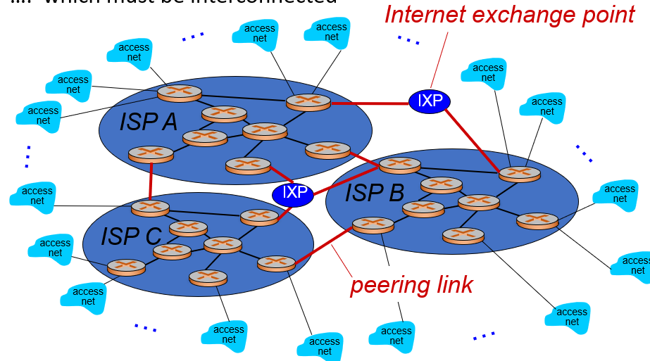
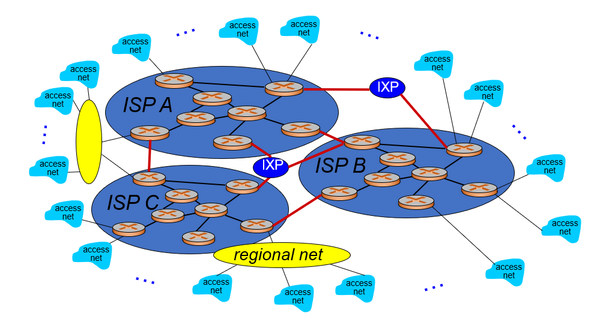
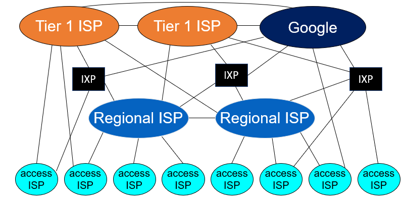

- _An_ internet is a network of networks
- _The_ Internet is the one that spans the world
- The Internet is a distributed network - don't need to get permission from a controller to become part of a network

- What is the internet? A service view:
      -  It's an infrastructure that provides services to applications: web, VoIP, email, social nets, etc.
      - Provides programming interface to apps:

- Hooks that allow sending and receiving app programs to "connect" to Internet
- Provides service options, analogous to postal service

- All communication activity on the Internet is governed by [protocols](Protocol.md)

## Internet structure: network of networks

- End systems connect to Internet via **access ISPs**
- Access ISPs in turn must be interconnected so that any two hosts can send packets to each other
- Can't connect every ISP to every other ISP, so instead have global transit ISPs
	- Customer and provider ISPs have economic agreements
- These global ISPs are interconnected
 

On top of that, there are are regional networks to connect access nets to ISPs

On top of *that*, content provider networks such as Google and Microsoft may run their own networks to bring services and content closer to end users

At the center are a few well-connected large networks
- Tier-1 commercial ISPs (e.g. Spring, AT&T), national and international coverage
- Content provider/distribution network (e.g. Google, Akamai): private network that connects its data centers to Internet, often bypassing tier-1 regional ISPs

## Internet network layer

[Internet network layer](Internet%20network%20layer.md)
