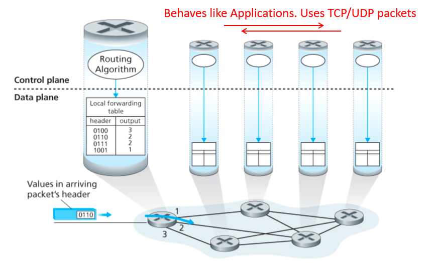

==TODO this is kinda just dumped here, file it under the appropriate notes==

Link to [Internet](Internet.md) for the graph

Connection between hosts involves:
1. Addressing
	- Unique identifier for global addressing
	- Link name for neighbors
2. Forwarding
	- Switching packets between links
3. Routing
	- Determining paths between hosts

Connections between hosts use the network itself to maintain the network:
