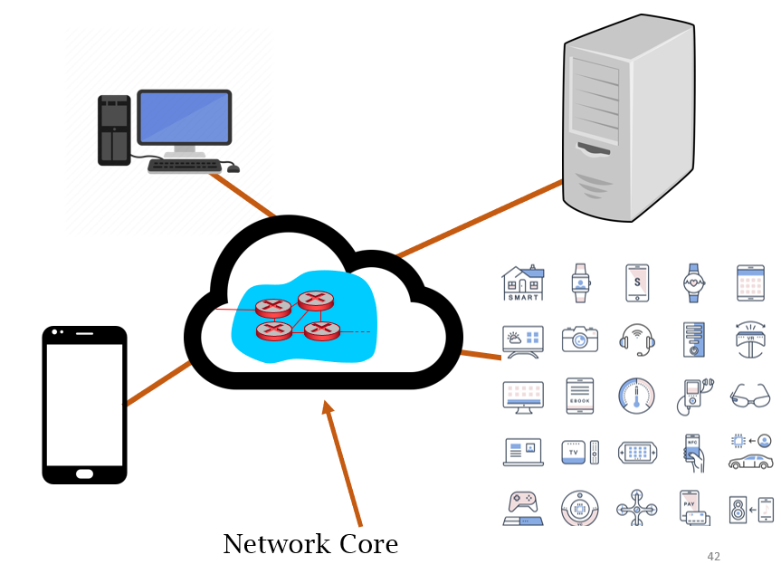

The network core is a mesh of interconnected routers

Hosts break application-layer messages into [packets](Packet.md) (this is [packet switching](Packet%20switching.md))
- Forward packets from one router to the next across multiple links to get from source to destination
- Each packet transmitted at full link capacity

Two key network core functions:
- [**Routing**](Routing/Routing.md): Determines source-to-destination route taken by packets
- **Forwarding**: Move packets from router's input to appropriate router output

Around the network core is the [network edge](Network%20edge.md)

