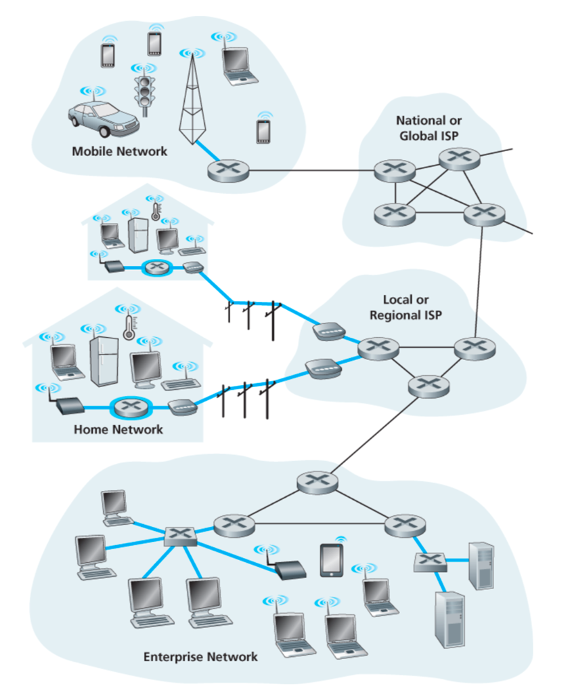

- Hosts: clients and servers
- Servers often in data centers
- Access networks, physical media: wired, wireless communication links
- Kinds of access networks:
	- [Home Networks](Home%20Networks.md)
	- [Ethernet](OSI%20layers/Link%20layer/Ethernet/Ethernet.md) (Enterprise access networks)
	- [WANs](WANs.md)

