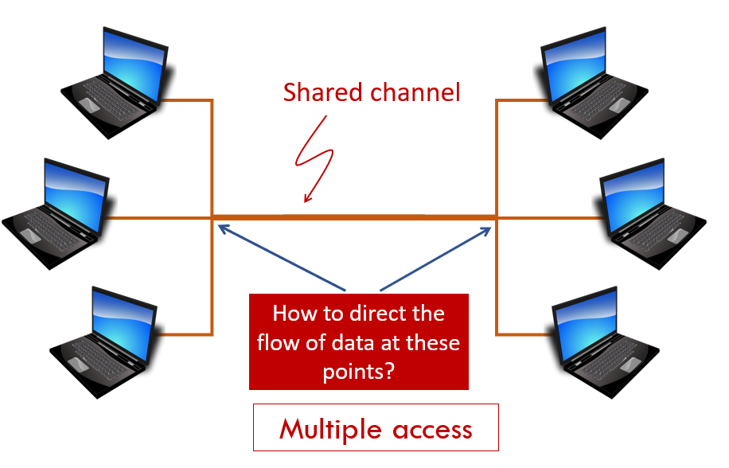

- One possible topology:
    - Point-to-point (P2P) connections
        - Every computer is connected directly to every other computer
        - Problem: Not scalable
- Solutions:
    - Star-like topology with a central node
        - Problem: network becomes centralized
    - Ring topology
        - Problem: Still not scalable with billions of computers
    - Multiple access
        - Shared channel, not totally centralized
        - This is what the [[Internet]] uses
        - To make sure every computer gets its chance to use the network, uses [[Switching]]
        - 