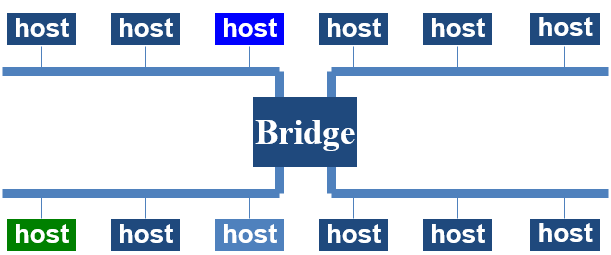

- Connects two or more LANs at the link layer
	1. Extracts destination address from the frame
	2. Looks up destination in table
	3. Forwards frame to appropriate segment
- Each segment can carry its own traffic
- Similar to [Switches](Switches.md)

