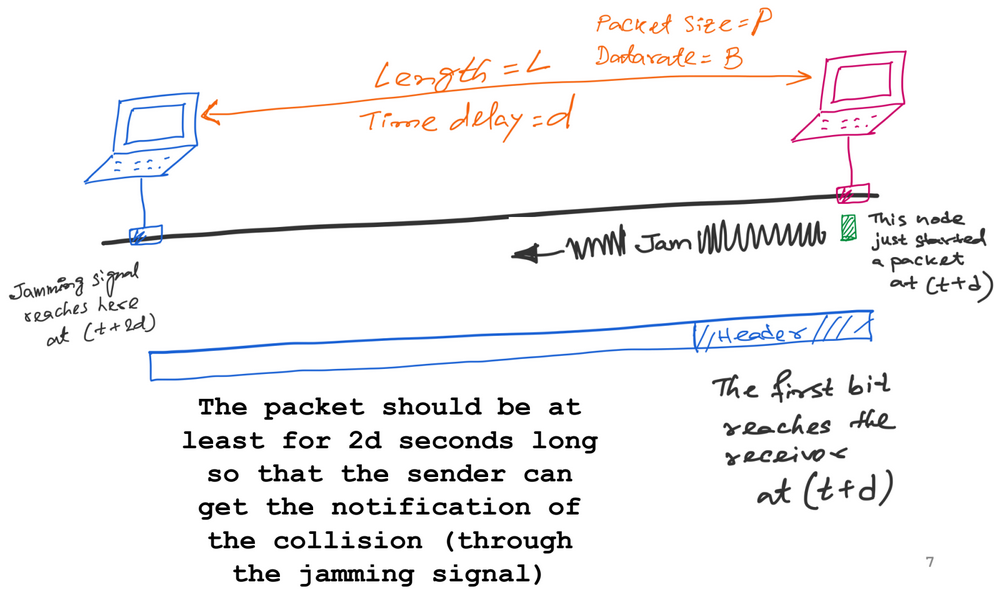

---
aliases:
  - Carrier Sense Multiple Access
  - CSMA/CD
---
A [Multi-Access Protocol](Multi-Access%20Protocol.md)

Carrier Sense Multiple Access (CSMA) is like human conversation:
- Carrier sense:
	- Listen before speaking and don't interrupt
- Collision detection:
	- Detect simultaneous talking and shut up
- Random access:
	- Wait for a random period of time before trying to talk again
	- $p$-persistent CSMA - if channel is idle, transmit the frame with probability $p$

But collisions can still occur
- Wasted transmissions

## Collision Detection

The "CD" part of CSMA/CD

- Collision happens when two packets overlap at receiver

==TODO see notes on preparing for worst-case scenario for collision (end of lecture 18 and midway through lecture 19)==

Worst-case scenario of collision:
- Two farthest nodes in the LAN
- Transmission time should be greater than or equal to `2 * propagation time` for CSMA/CD to work
- Formula for minimum packet size (P) or maximum length (L):
	- $2L/c = 2d = P/B$, where $c$ is the speed of propagation

- When receiver detects collision
	- Stop sending
	- Send jamming signal to ensure collision detection by all nodes in the link

## CSMA for [WiFi](WiFi/WiFi.md)

Can use Collision Avoidance but not Collision Detection

- Cannot detect all collisions
- Cannot listen while sending

### Hidden Terminal Problem
