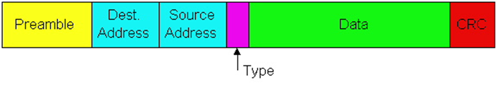

---
aliases:
  - Ethernet
  - Enterprise access networks
tags:
  - protocol
---
- Enterprise access networks (Ethernet)
- Typically used in companies, universities, etc.
- 10 Mbps, 100Mbps, 1Gbps, 10Gbps transmission rates
- Today, end systems typically connect into Ethernet switch
- Ethernet is **connectionless** and **unreliable**

Uses [CSMA/CD](CSMA.md):
- Carrier Sense: Wait for link to be idle
	- Channel idle: start transmitting
	- Channel busy: wait until idle
	- A strategy is p-persistent if, after waiting for the line to clear, the sender sends with probability <=1
- Collision Detection: listen while transmitting
	- No collision: transmission is complete
	- Collision: abort transmission, and send jam signal
- Random Access: exponential backoff
	- After collision, wait random time before trying again
	- After $m$th collision, choose $k$ randomly from $\{0, ..., 2^{m-1}\}$ and wait for $512k$ bit times before trying again

## Ethernet Frame Structure

- Sending adapter encapsulates packet in frame
- Preamble: synchronization
	- 7 bytes with pattern `10101010`, followed by 1 byte with pattern `10101011`
	- Used to synchronize receiver, sender, clock rates
- Addresses: source and destination MAC addresses
	- Adapter passes frame to network-level protocol if destination is local MAC address or broadcast address
	- Otherwise, adapter discards frame
- Type: indicates higher level protocol
	- Usually [IP](IP/IP.md), but also others
- CRC: cyclic redundancy check

