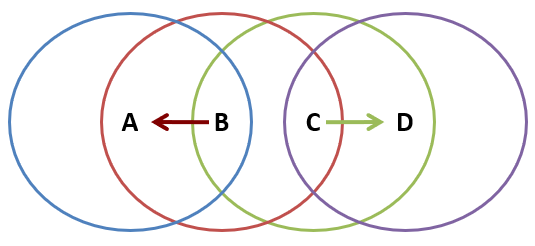

Problem with [WiFi](WiFi/WiFi.md)
- B is sending to A, C wants to send to D
- As C receives B's packets, carrier sense (see [CSMA](OSI%20layers/Link%20Layer/CSMA.md)) would prevent it from sending to D, even though wouldn't interfere
- [RTS/CTS](OSI%20layers/Link%20Layer/Virtual%20Carrier%20Sensing.md) would help
	- C hears RTS from B, but not CTS from A
	- C knows its transmission wouldn't interfere with A
	- C is safe to transmit to D

## Impact on Higher Layer Protocols

- Wireless and mobility change path properties
	- Wireless: Higher packet loss, not from congestion
	- Mobility: transient disruptions and changes in RTT
- Logically, impact should be minimal
	- Best-effort service model remains unchanged
	- TCP and UDP can and do run over wireless, mobile
- But, performance is affected
	- TCP treats packet loss as a sign of congestion
	- TCP tries to estimate RTT to drive retransmissions
	- TCP does not perform well on out-of-order packets
- Internet not designed with these issues in mind
