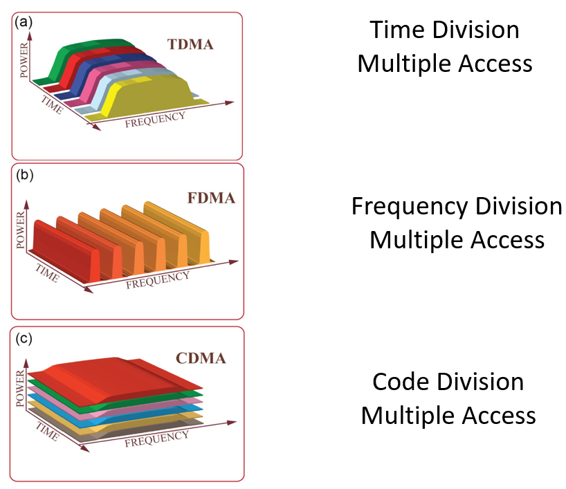

---
aliases:
  - Multiple Access Protocol
---
- Divide the channel into pieces
	- In time or frequency
- Take turns
	- Pass a token for the right to transmit
- Defer action
	- Let collisions happen
	- Then detect and recover from them

Types:
1. Time Division Multiple Access
2. Frequency Division Multiple Access
3. Code Division Multiple Access
4. [Carrier Sense Multiple Access](OSI%20layers/Link%20layer/CSMA.md)

## Comparison

|      | FDMA (and CDMA?)        | TDMA                                      | CSMA                            |
| ---- | ----------------------- | ----------------------------------------- | ------------------------------- |
| Good | Efficient at high load  | Eliminates empty slots without collisions | Efficient at low load           |
| Bad  | Inefficient at low load | Vulnerable to failures (e.g. lost token)  | Collision overhead at high load |
