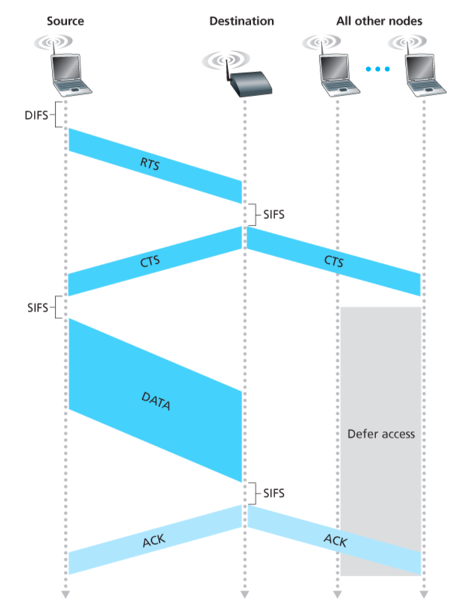

---
aliases:
  - RTS/CTS
  - RTS-CTS
---
- First exchange control frames before transmitting data
	- Sender issues Request To Send (RTS), including length of data
	- Receiver responds with Clear To Send (CTS)
- If sender sees CTS, transmit data (of specified length)
- If other node sees CTS, will idle for specified period
- If other node sees RTS but not CTS, free to send

