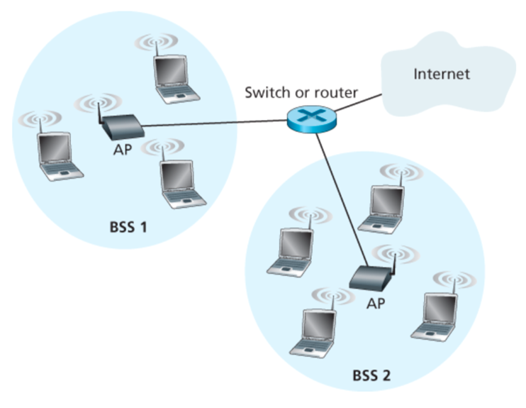

- Larger network with which a wireless host wants to communicate
- Typically a wired network
- Provides traditional network services

## Infrastructure Mode

- Base station connects mobiles into wired network
- Network provides services (addressing, routing, DNS)
- Handoff: mobile host can change to a different base station that is providing connection to wired network

## Architecture

- [Access Point](Access%20Point.md)
- Basic Service Set (BSS)
	- Coverage of one AP
	- AP acts as the master
	- Identified by [SSID](SSID.md)

