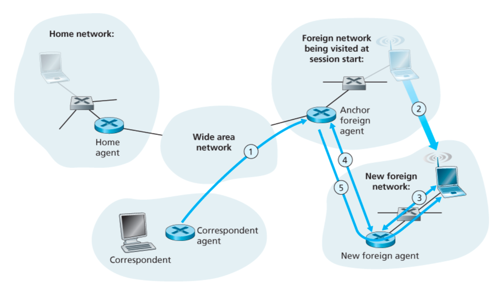

Mobility is a spectrum:
- No mobility: Mobile wireless user, using same [Access Point](802.11%20LAN%20Architecture/Access%20Point.md)
- More mobility: Mobile user, connecting/disconnecting from network using DHCP
- High mobility: Mobile user, passing through multiple access points while maintaining ongoing connections (like cell phone)

## Vocabulary

- Home network: "home" of mobile (e.g. 128.119.40/24)
- Permanent address: address in home network, can always be used to reach mobile
	- Remains constant
	- e.g. 128.119.40.186
- Home agent: Entity that will perform mobility functions on behalf of mobile, when mobile is remote
- Visited network: Network in which mobile currently resides
	- e.g. 79.129.13/24
- Care-of-address: Address in visited network
	- e.g. 79.129.13.2
- Foreign agent: Entity in visited network that performs mobility functions on behalf of mobile
- Correspondent: Wants to communicate with mobile

## Approaches

- Let routers handle it
	- Routers advertise permanent address of mobile-nodes-in-residence via usual routing table exchange
	- Routing tables indicate where each mobile located
	- No changes to end-systems
	- **Not scalable to millions of mobiles**
- Let end-systems handle it (two ways)
	- Indirect routing
	- Direct routing

### Indirect Routing

1. Communication from correspondent to mobile goes through home agent
2. Home agent forwards to foreign agent
3. Foreign agent forwards to mobile
4. Mobile replies directly to correspondent

- Requires packet encapsulation along the way (==TODO look at the Packet Encapsulation slide==)
- Mobile uses two addresses:
	- Permanent address - used by correspondent (hence, mobile location is **transparent** to correspondent)
	- Care-of-address - used by home agent to forward datagrams to mobile
- Foreign agent functions may be done by mobile itself
- Triangle routing: Correspondent-home-network-mobile
	- Inefficient when correspondent and mobile are in same network

### Direct Routing

1. Correspondent asks home network for foreign address of mobile
2. Home network responds with foreign address
3. Correspondent sends to foreign agent
4. Foreign agent forwards to mobile
5. Mobile replies directly to correspondent

## Registration

1. Mobile contacts foreign network on entering visited network
2. Foreign agent contacts home agent home: "this mobile is resident in my network"

End result:
- Foreign agent knows about mobile
- Home agent knows location of mobile

## Mobility Through Multiple Foreign Networks

