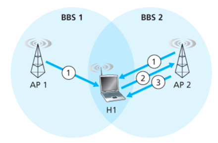
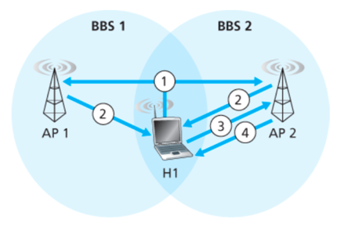

## Passive Scanning

1. Beacon frames sent from APs
2. Association Request frame sent: H1 to selected AP
3. Association Response frame sent: selected AP to H1

## Active Scanning

1. Probe Request frame broadcast from H1
2. Probe Response frames sent from APs
3. Association Request frame sent: H1 to selected AP
4. Association Response frame sent: selected AP to H1

