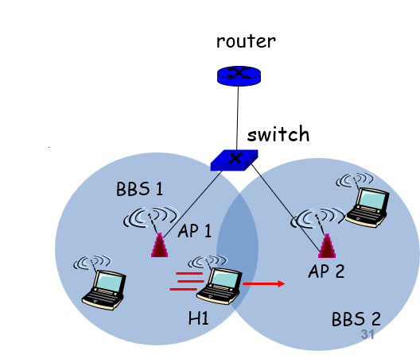

---
tags:
  - protocol
---
## Modes

Two modes:
- [Infrastructure Mode](802.11%20LAN%20Architecture/Infrastructure%20Mode.md)
- [Ad-hoc Mode](802.11%20LAN%20Architecture/Ad-hoc%20Mode.md)

## High Bit Error Rate

With wired links, most loss is due to congestion. With wireless links, there is higher loss and a time-varying bit error rate.

- Decreasing signal strength
	- Disperses as it travels greater distances
	- Attenuates as it passes through matter
- Interference from other sources
	- Radio sources in same frequency band
	- Electromagnetic noise
- Multipath propagation
	- Electromagnetic waves reflect off objects
	- Taking many paths of different lengths
	- Causing blurring of signal at the receiver

Dealing with bit errors:
- Sender could increase transmission power
	- Requires more energy (bad for battery-powered hosts)
	- Creates more interference with other senders
- Stronger error detection and recovery
	- More powerful error detection/correction codes
	- Link-layer retransmission of corrupted frames

## Broadcast Limitations

See [WiFi Broadcast Limitations](WiFi%20Broadcast%20Limitations.md)

## Mobility Within Same Subnet

- H1 remains in same subnet
	- IP address of the host can remain same
	- Ongoing data transfers can continue uninterrupted
- H1 recognizes the need to change
	- H1 detects a weakening signal
	- Starts scanning for a stronger one
- Changes [Access Points](802.11%20LAN%20Architecture/Access%20Point.md) with same SSID
	- H1 disassociates from one and associates with another
- Switch learns new location
	- Self-learning mechanism

