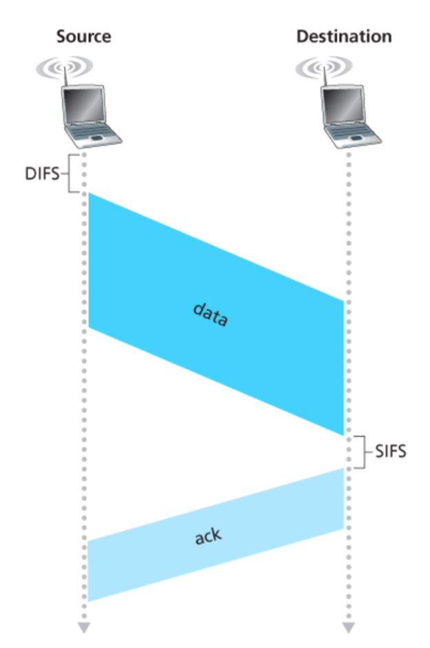

---
tags:
  - protocol
---

## High Bit Error Rate

With wired links, most loss is due to congestion. With wireless links, there is higher loss and a time-varying bit error rate.

- Decreasing signal strength
	- Disperses as it travels greater distances
	- Attenuates as it passes through matter
- Interference from other sources
	- Radio sources in same frequency band
	- Electromagnetic noise
- Multipath propagation
	- Electromagnetic waves reflect off objects
	- Taking many paths of different lengths
	- Causing blurring of signal at the receiver

Dealing with bit errors:
- Sender could increase transmission power
	- Requires more energy (bad for battery-powered hosts)
	- Creates more interference with other senders
- Stronger error detection and recovery
	- More powerful error detection/correction codes
	- Link-layer retransmission of corrupted frames

## Link Layer ACK

Need link layer ACK to deal with bit errors

`SIFS` is smaller than `DIFS` to give priority to the channel to send the acknowledgment

## Broadcast Limitations

==TODO do this==

## Base Station

- Typically connected to wired network
- Relay responsible for sending packets between wired network and wireless hosts in its area
- e.g. cellt owers, 802.11 access points

## Infrastructure

- Larger network with which a wireless host wants to communicate
- 
