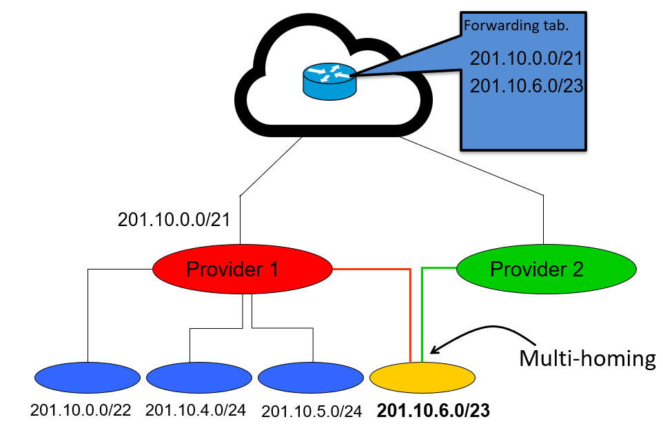

---
aliases:
  - Classless Inter-Domain Routing
  - Classless Addressing
---
Improvement on [Classful Addressing](OSI%20layers/Network%20Layer/IP/Classful%20Addressing.md)

Uses **variable length subnet masking** - network prefixes have variable length
- See [Subnets](OSI%20layers/Network%20Layer/IP/Subnets.md) for info on subnet masks

Example: /8 means the network prefix size is 8 (class A)

## IP Forwarding

> [!note]
> CIDR makes packet forwarding harder

Because prefixes are variable length, can't use old forwarding method

Need to find longest match between an IP address and the variable length prefixes

Multi-homing: A host might use multiple providers
- One provider might be the primary and the other might be a backup/secondary

### Problem with multi-homing

- Provider 1 has aggregated the four subnets
- The yellow address (201.10.6.0/23) is being shared through both Provider 1 and Provider 2
- ~~Provider 2 may use a different address (e.g. 192.0.0.1) for yellow network~~
- An address like 201.10.6.17 would match both 201.10.0.0/21 and 201.10.6.0/23
- So, use **longest prefix match forwarding**
	- Router identifies longest-matching prefix (here, 201.10.6.0/23)