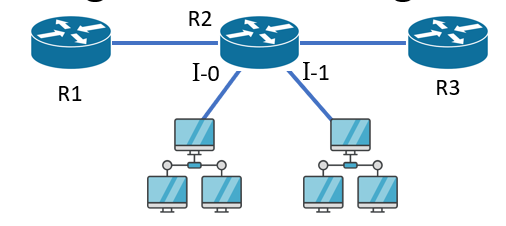
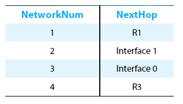

Strategy:
- Every datagram contains destination's address
- If directly connected to destination network, then forward to host
- If not directly connected to destination network, then forward to some router
- Forwarding table maps network number into next hop
- Each host has a **default router**
- Each router maintains a forwarding table

Example (router R2 wants to send a datagram):

R2's forwarding table:

Algorithm:
- First find `NetworkNum` of destination
- If `NetworkNum` of destination equals `NetworkNum` of one of my interfaces, then deliver packet to destination over that interface
- Else, if `NetworkNum` of destination is in my forwarding table, then deliver packet to `NextHop` router
- Else deliver packet to default router