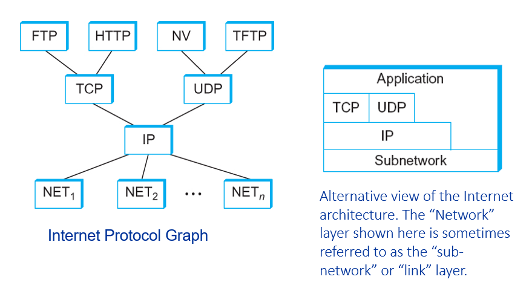

- Internet has multiple [protocol](Protocol.md) layers
- Each layer implements a service, relying on services provided by layers below
- Enables encapsulation

Example of layered network system:
1. Application programs ([Application layer](Application%20layer.md))
2. Process-to-process channels ([Transport layer](Transport%20layer.md))
3. Host-to-host connectivity ([Network layer](Network%20layer.md) and [Data link layer](Data%20link%20layer.md) (?))
4. Hardware ([Physical layer](Physical%20layer.md))

## [Internet](Internet.md) [protocol](../Protocol.md) stack (OSI 7-layer model)

- The bottom 3 layers are implemented on all nodes
	- Network, data link, physical
- The top layers typically run only on end-to-end hosts rather than intermediate switches and routers
	- Application, presentation, session, transport

### Application layer

### Presentation layer

### Session layer

### Transport layer

### Network layer

### Data link layer

### Physical layer

