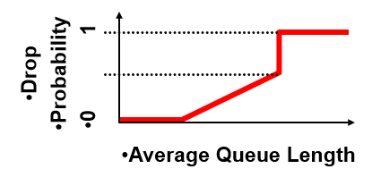

---
aliases:
  - Random Early Detection
---
**Random Early Detection (RED)**

- Router notices that queue is getting full and randomly drops packets to signal congestion
- Packet drop probability
	- Drop probability increases as queue length increases
	- Else, set drop probability to some function of average queue length

Properties of RED:
- Drops packets before queue full, in hopes of reducing the rates of some flows
- Drops packets in proportion to each flow's rate
	- High-rate flows selected more often
- Drops are spaced out in time to help desynchronize the TCP senders
- Tolerant of burstiness in traffic by basing decisions on average queue length

### Problems with RED

- Hard to get tunable parameters just right
	- How early to start dropping packets?
	- What slope for increase in drop probability?
	- What time scale for averaging queue length?
- Has to drop packet to give feedback, unlike [ECN](#explicit-congestion-notification-ecn)
- RED has mixed adoption in practice
	- If parameters not set right, RED doesn't help