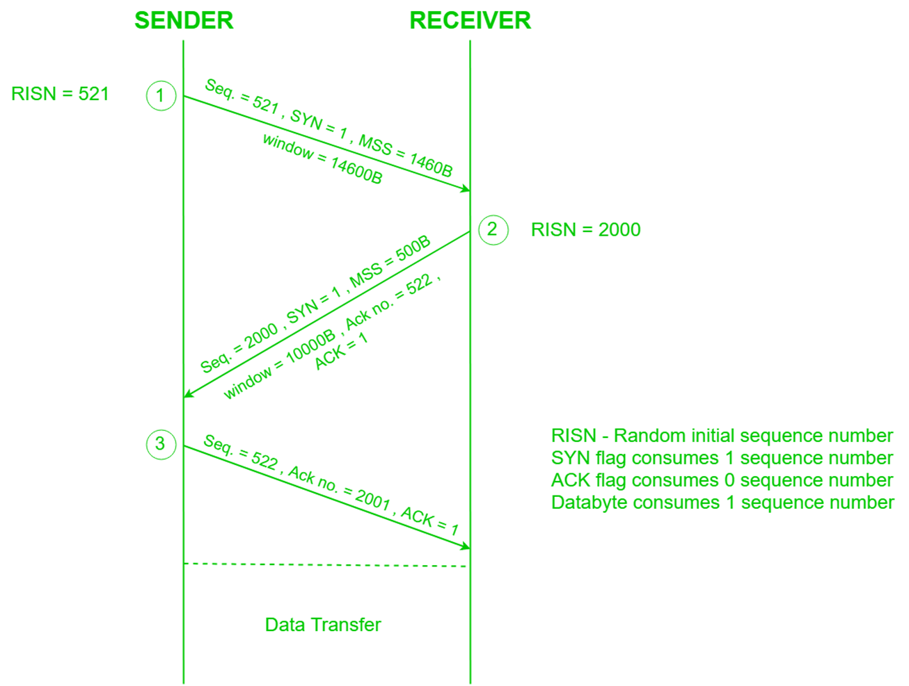

1. Host A sends SYN (synchronization) to Host B
	- ISN = 521 so sequence number 521
2. Host B returns a SYN acknowledgment (SYN ACK)
	- Host B's ISN is 2000, so sequence number is 2000
	- Previous sequence number was 521, so ack no. is 522 (increment)
3. Host A sends an ACK to acknowledge the SYN ACK
	- Host B's ISN was 2000, so ack no. is 2001

Each host tells its ISN to the other host

