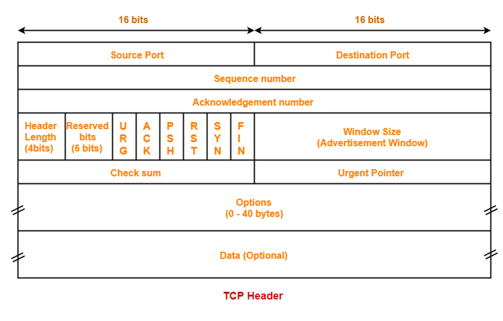

[TCP](TCP.md) Header

## Fields

## Flags

- PSH (push):
	- Used for chat servers
	- Send data packet immediately even if it's only a small piece of data
- URG (urgent):
	- Urgent pointer tells the receiver that the data there is important
	- Used in TELNET but not used much outside of that
