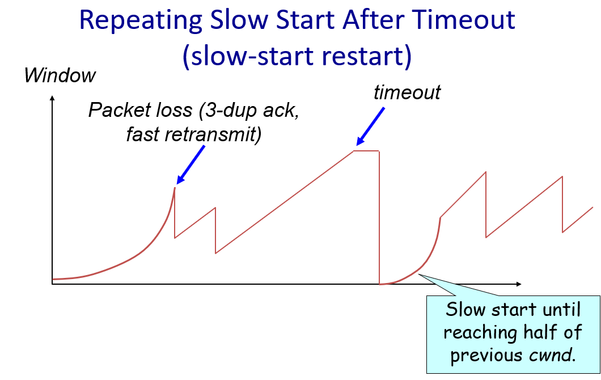

Two types of [TCP](TCP.md) losses:
1. Triple duplicate ACK (response: [Fast retransmit](Fast%20Retransmit%20+%20Fast%20Recovery.md))
	- Packet $n$ is lost, but packets $n+1$, $n+2$, etc. arrive
	- Then, sender quickly resends packet $n$
	- Do a multiplicative decrease and keep going
2. Timeout (repeat slow start - slow start restart)
	- Packet $n$ is lost and detected via timeout
	- Blasting entire congestion window would cause another burst
	- Better to start over with a new congestion window (CWND=1)
	- Slow-start restart: [Slow start](Congestion/Slow%20start.md) until reaching half of previous CWND
		- Why not restart at old CWND?
		- Suppose TCP connection goes idle for a while
		- Network conditions might change in between, maybe link is now backed up
		- Dangerous to start transmitting at old rate - previously idle sender might blast network

