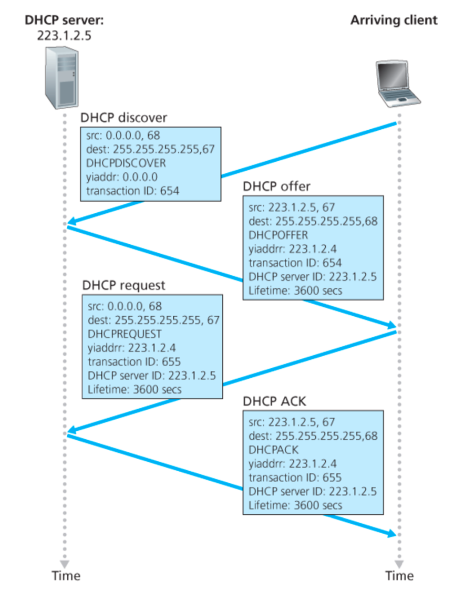

---
tags:
  - protocol
aliases:
  - Dynamic Host Configuration Protocol
---
- DHCP (Dynamic Host Configuration Protocol) lets you dynamically get an address from a server
- Uses [UDP](UDP)
- Only hold address while connected/on
	- Allows reuse of address
	- Can renew lease on address in use
- Support for mobile users who want to join network

Steps:
1. Client sends DHCP discover packet
2. DHCP server sends DHCP offer
3. Client sends DHCP request
4. DHCP server sends DHCP ACK

All of these steps are done on broadcast address so that all computers on network know about the new guy
 