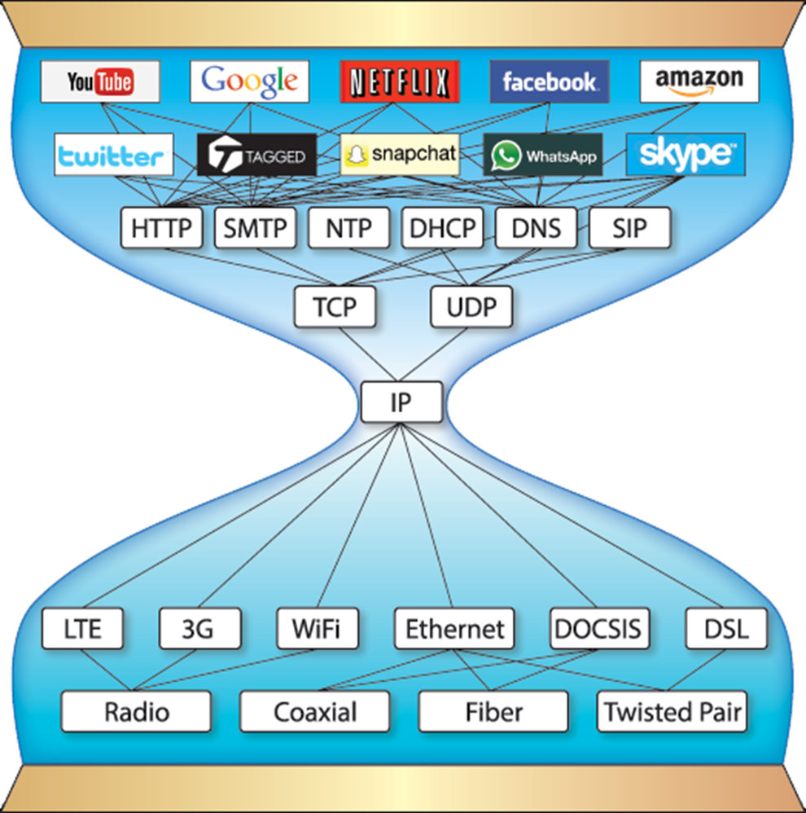
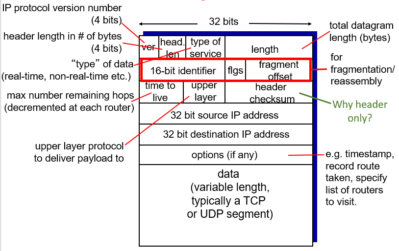

---
aliases:
  - Internet Protocol
---
- IP = Internet Protocol
- Runs on all the nodes in a collection of networks and defines the infrastructure that allows these nodes and networks to function as a single logical internetwork

## IP Service Model

- Packet delivery model
	- Connectionless - only cares about handing to right neighbor, doesn't need a connection
	- Best-effort delivery (unreliable service)
		- Packets are **lost**
		- Packets are delivered **out of order**
		- **Duplicate** copies of packet are delivered
		- Packets can be **delayed** for a long time
- Global addressing scheme
	- Provides a way to identify all hosts in the network

## IP datagram format (packet format)

- In the image below, at the bottom is the data (variable size)
	- Data size = datagram length - header length
- Everything above is the header
	- Variable size (20 bytes default without options)
- It only has a checksum for the header (not the data) because it only cares about the header
	- Higher level protocols will deal with the data

## IP Fragmentation and Reassembly

- **Maximum Transmission Unit (MTU)** - Maximum length of packet
	- Default 1500 bytes
	- This is used because of hardware limitations
	- Larger packets occupy a link for longer
- If packet length is bigger than some router's MTU, need to fragment it
- Packets get reassembled at destination