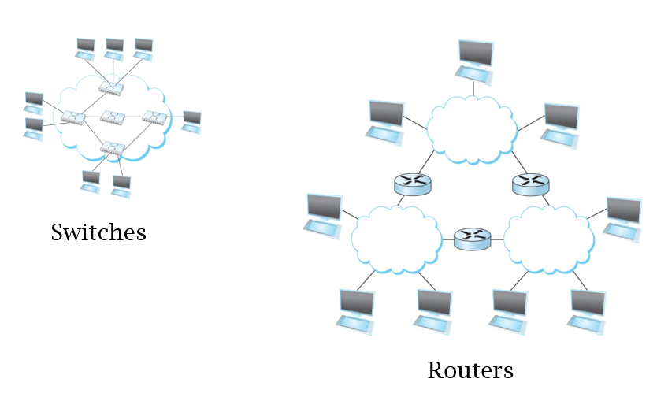

---
tags:
  - hide
---
- [Switches](OSI%20layers/Link%20Layer/Switches.md) are [link level](OSI%20layers/Link%20Layer/Link%20Layer.md) devices used to isolate or combine physical networks
- Routers are [network layer](OSI%20layers/Network%20Layer/Network%20Layer.md) devices for IP routing and forwarding tasks
	- Higher level than switches

