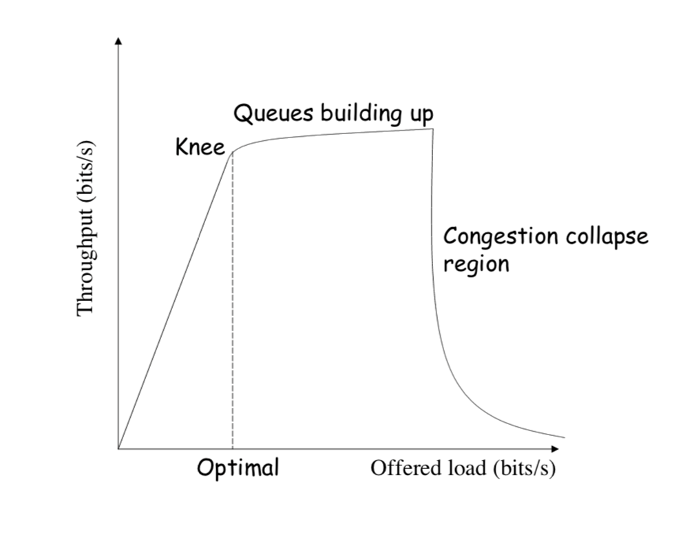

Flows contend for two resources
1. Link bandwidth
2. Queue space

Leads to congestion

A network is considered congested if contention for resources leads toward queue build-ups and packet drops
- Best-effort network does not "block" calls
	- So they can easily become overloaded
	- Congestion == load higher than capacity
- Examples of congestion
	- Link layer: Ethernet frame collisions
	- Network layer: full IP packet buffers
- Excess packets are dropped
	- And sender retransmits

Throughput vs Load:

### Congestion collapse

Too much throughput easily leads to congestion collapse
- Senders retransmit lost packets
- Leading to an even greater load and even more packet loss

### Detecting congestion

- Link layer
	- Carrier sense multiple access
	- Seeing your own frame collide with others
- Network layer
	- Observe end-to-end performance
	- Packet delay or loss over the path

How TCP detects packet losses:
1. Duplicate ACKs
	- Packet N is lost, but packets N+1, N+2, etc. are received and ACKs are sent
2. Timeout
	- Packet N is lost and detected via a timeout

### Responding to congestion

- Upon detecting congestion
	- Decrease sending rate
- But if more bandwidth becomes available, you don't want to continue sending at low rate
- Upon *not* detecting congestion
	- Increase sending rate, a little at a time
	- See if packets get through

### TCP congestion control
- ACK works as the indicator and the window controls the flow
- Congestion_window: calculated by sender
- Additive increase, multiplicative decrease
	- On packet loss, divide congestion window in half
		- Exponential decrease because:
			- Congestion is very bad, need to react aggressively
			- Nice theoretical properties, makes efficient use of network resources
	- On success for last window, increase window linearly

### Congestion window

- Each TCP sender maintains congestion window
	- Max number of bytes to have in transit (not yet ACK'd)
- Adapting the congestion window
	- Decrease upon losing a packet
	- Increase upon success: optimistically exploring
	- Always looking for right transfer rate
- Pro: avoids explicit network feedback
- Con: constantly over- and under-shoots "right" rate

#### Difference between advertised window and congestion window

- Flow control keeps a *fast sender* from overwhelming a *slow receiver*
- Congestion control keeps a *set of senders* from overloading the *network*
- Different concepts, but similar mechanisms
	- Sender TCP window = `min(congestion_window, receiver_window)`
