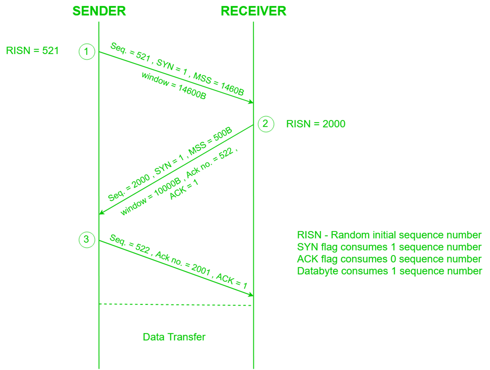

---
tags:
  - protocol
---
Transmission Control Protocol (TCP) is a [transport layer](OSI%20layers/Transport%20layer.md) protocol

Maintains illusion that both hosts are using the same buffer
- Host A writes to its segment, Host B reads from its segment
- Segment sent when one of the following are true:
	- Segment full (dynamic parameter called Max Segment Size)
	- Timeout
	- "Pushed" by application

Sequence number:
- Sequence number is not necessarily globally unique, but unique to one flow
- ISN = initial sequence number
	- Chosen randomly
	- ==TODO read up on this==
- Sequence number = ISN + (number of first byte of segment)

## Handshakes

1. Host A sends SYN (synchronization) to Host B
	- ISN = 521 so sequence number 521
2. Host B returns a SYN acknowledgment (SYN ACK)
	- Host B's ISN is 2000, so sequence number is 2000
	- Previous sequence number was 521, so ack no. is 522 (increment)
3. Host A sends an ACK to acknowledge the SYN ACK
	- Host B's ISN was 2000, so ack no. is 2001

Each host tells its ISN to the other host

## ISN

Why does ISN have to be random?
- ==TODO==

## What if SYN Packet Gets Lost?

Suppose SYN packet gets lost
- Packet lost inside network or server rejects packet (e.g. listen queue full)
- Eventually, no SYN ACK arrives
- Sender sets a timer and waits for SYN ACK
- Retransmits SYN if needed

## Tearing Down Connection

Closing each end of the connection:
1. One host calls `close()`
	- TCP sends all remaining bytes
	- TCP sends FIN to close and receive remaining bytes
2. The other host eventually gets EOF
	- Sends FIN ACK to acknowledge
3. Reset (RST) to close and not receive remaining bytes

## PSH and URG flags

PSH (push):
- Used for chat servers
- Send data packet immediately even if it's only a small piece of data

URG (urgent):
- Urgent pointer tells the receiver that the data there is important
- Used in TELNET but not used much outside of that

## Header

