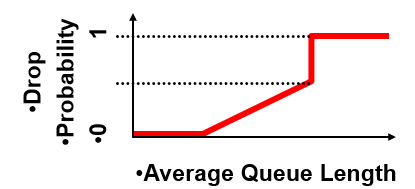

Goal: balance throughput and delay
- Huge buffers minimize drops, but add to queueing delay (thus higher RTT, longer slow start, etc.)

## FIFO Scheduling and Drop-Tail

- Access to the bandwidth: FIFO queue
	- Packets only differentiated when they arrive
- Access to the buffer space: drop-tail queueing
	- If the queue is full, drop the incoming packet
- Drop-tail queueing leads to **bursty loss**
	- Congested link: many packets encounter full queue
	- Synchronization: many connections lose packets all at once
- Slow feedback from drop-tail:
	- Feedback comes when buffer completely full, even though the buffer has been filling for a while
	- The filling buffer is also increasing RTT, making detection even slower
	- Better to give early feedback:
		- Get 1-2 connections to slow down before it's too late

## Random Early Detection (RED)

- Router notices that queue is getting full and randomly drops packets to signal congestion
- Packet drop probability
	- Drop probability increases as queue length increases
	- Else, set drop probability to some function of average queue length

Properties of RED:
- Drops packets before queue full, in hopes of reducing the rates of some flows
- Drops packets in proportion to each flow's rate
	- High-rate flows selected more often
- Drops are spaced out in time to help desynchronize the TCP senders
- Tolerant of burstiness in traffic by basing decisions on average queue length

### Problems with RED

- Hard to get tunable parameters just right
	- How early to start dropping packets?
	- What slope for increase in drop probability?
	- What time scale for averaging queue length?
- Has to drop packet to give feedback, unlike [ECN](#explicit-congestion-notification-ecn)
- RED has mixed adoption in practice
	- If parameters not set right, RED doesn't help

## Explicit Congestion Notification (ECN)

- Router marks the packet with an ECN bit
- Sending host interprets as a sign of congestion
- Requires participation of hosts and the routers