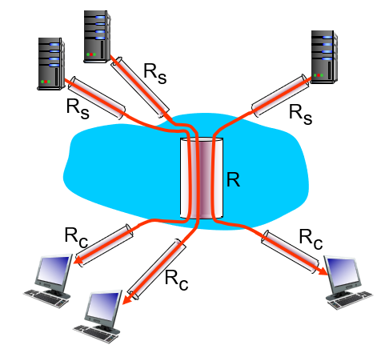

Throughput is rate (bits/time unit) at which bits transferred between sender/receiver
- Instantaneous: rate at given point in time
- Average: rate over longer period of time

**Bottleneck link:** link on end-to-end path that constrains end-to-end throughput

## Scenario

Suppose there are 10 connections all sharing a backbone bottleneck link
- $R_C$ is the client's [bandwidth](Bandwidth.md), $R_S$ is the server's, $R$ is the backbone link's
- Then the per-connection throughput is $\mathrm{min}(R_C, R_S, R/10)$
- In practice, the bottleneck is often $R_C$ or $R_S$ rather than $R$

## Throughput vs Bandwidth

![[Bandwidth vs Throughput]]
