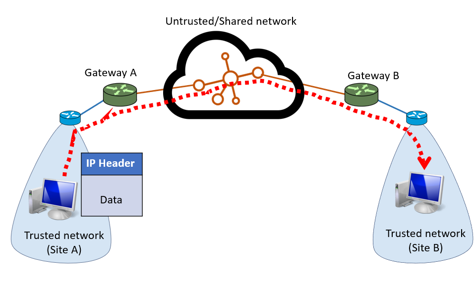
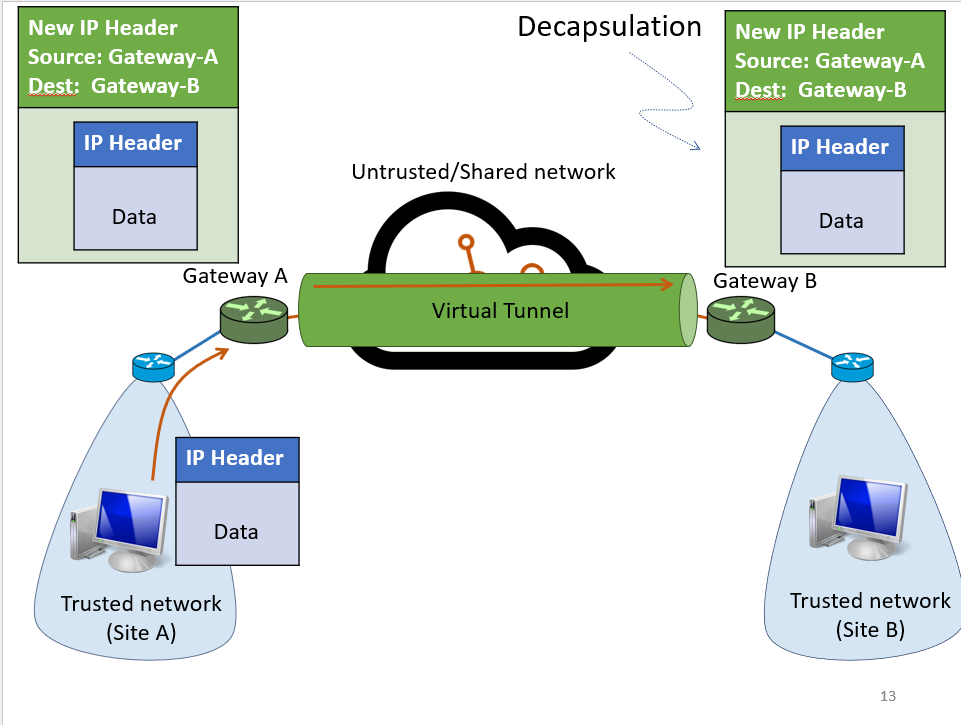

---
aliases:
  - VPN
  - Virtual Networks
  - Tunneling
---
You may have two separate trusted networks that are connected by an untrusted/shared network

Use virtual tunnels to encapsulate

Whenever a packet is passed, the Internet will see this as Gateway A sending a packet to Gateway B
- Encapsulation: Wrap the IP packet in another IP packet
- Decapsulation: rip off IP header to get actual IP header
- Also add encryption

Pros:
- Security
- Special capabilities between routers (e.g. multicast)
- Supporting heterogeneity (==TODO what does this mean==)
Cons:
- Increases packet length
	- Wastage of bandwidth
	- More processing
	- Increased fragmentation
- Increases management cost